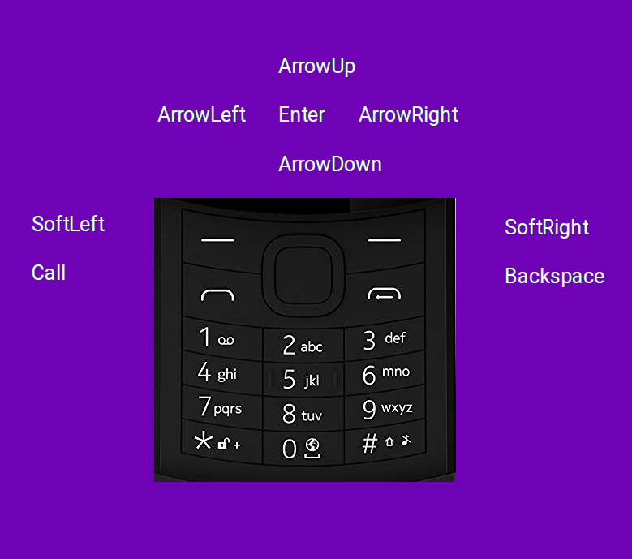

# KaiOS Reference

## Setup
1. Download [Firefox <= v59](https://ftp.mozilla.org/pub/firefox/releases/)
2. Keep Firefox from updating with [policies.json](https://github.com/mozilla/policy-templates) OR setting [preferences](about:preferences) to "never check for updates"
3. Install [ADB](https://developer.android.com/studio/command-line/adb)

## Debug Mode
Dial `*#*#33284#*#*` to enter debug mode.
If this code dosn't work see [other options](https://sites.google.com/view/bananahackers/development/debug-mode) depending on your device.

## Manifest
The app manifest file describes the entrypoint and other information about your app to KaiOS.

## App Icons
https://developer.kaiostech.com/design-guide/launcher-icon
```json
"icons": {
  "56": "/img/ic_Appname_56.png",
  "112": "/img/ic_Appname_112.jpg"
}
```

Resizing with imagemagick
```sh
convert ic_Appname.png -resize 56x56\! ic_Appname_56.png
convert ic_Appname.png -resize 112x112\! ic_Appname_112.png
```

## Borowserlist
Past this config into `.browserlistrc` in the project directory. Using bable requires @bable/preset-env 
```text
last 1 version
kaios
```

## ADB
### Install
#### OSX
Should be no configuration.
#### Linux
- Debian/Ubuntu based distors follow [KaiOS Docs](https://developer.kaiostech.com/getting-started/env-setup/os-env-setup)
- RPM & Arch based linux distros should follow instruction on the [arch wiki](https://wiki.archlinux.org/index.php/Android_Debug_Bridge)
- Make sure you have installed adb, setup udev rules, and added user to the appropriate adb group.

### List Devices
```sh
adb devices
```

### Troubleshooting
Sometimes linux report no adb permisions on device.
Try reseting the udev rules, and restarting the adb server
```sh
sudo udevadm control --reload-rules
sudo adb kill-server
sudo adb start-server
adb devices
```


### Enter shell on device
```sh
adb shell
```

#### Get device stats
```sh
cat /proc/cpuinfo
cat /proc/meminfo
cat /proc/zoneinfo
free -m
```

#### Watch memory use
```sh
top -m 5 -s rss -d 1
pmap
```

### Log system events
[logcat](https://developer.android.com/studio/command-line/logcat) is equivalent to `journalctl -f` (tailing logs)

from an adb shell run
```sh
logcat
```

### Dump system services
Use [dumpsys](https://developer.android.com/studio/command-line/dumpsys) to dump running services
```sh
sysdump
```

### Trace userspace process
Trace userspace process with `atrace`
```sh
atrace
```

### adb over wifi
Connect to devices over wifi
With device plugged in, set device to listen for TCP/IP connections on port 5555
```sh
adb tcpip 5555
```
Unplug device, and connect to device over network
```sh
adb connect <device ip>
```
Confirm device is connected
```sh
adb devices
```
Read more [here](https://developer.android.com/studio/command-line/adb#wireless)

## Keypad


## Docs
- [KaiOS Docs](https://developer.kaiostech.com/)
- [KaiOS Solutions](https://support.kaiostech.com/en/support/solutions)
- [Jio Docs](http://www.jiodevelopers.com/developer-portal/)
- [Banana Hackers](https://sites.google.com/view/bananahackers/)

## Notes
- [Google Assistant on feature phones](https://developers.google.com/assistant/surfaces/feature-entry-level-phones)


- zip package
```sh
zip -r package.zip src
```


- maybe not wasm but asm.js possible with [emscripten](https://emscripten.org/docs/getting_started/index.html)
https://zserge.com/posts/my-experience-with-asmjs/

## Talks
- [Google IO: Next Billion Users](https://www.youtube.com/watch?v=ak6Uj02DTjk)
- [Google IO: Proxx Game](https://youtu.be/w8P5HLxcIO4)
- [Firefox OS is back. on KaiOS](https://youtu.be/_UPk3mpcDP4)

## Example App: Proxx
[Proxx](https://proxx.app/) (by google)

Specs:
- Initial Payload < 25k
- Time to interactive < 5 sec on slow 3G
- 60 fps
- [Preact](https://preactjs.com/)
- [Comlink](https://github.com/GoogleChromeLabs/comlink)
- Accessiblity with [tabindex](https://developers.google.com/web/fundamentals/accessibility/focus/using-tabindex) (checkout https://web.dev/accessible/)
- [Number keys in UX](https://youtu.be/w8P5HLxcIO4?t=1720)
- [Travis size report](https://github.com/GoogleChromeLabs/travis-size-report)

## Devices
- Low End: MTN Smart S
- High End: Nokia 8110
- [Device List](https://www.kaiostech.com/explore/devices/)
- [MTN phones](https://simbatelecom.com/product/mtn-kamunye/)
- [KaiOS USA prepaid phones](https://www.bestbuy.com/site/searchpage.jsp?_dyncharset=UTF-8&browsedCategory=pcmcat158500050014&id=pcat17071&iht=n&ks=960&list=y&qp=operatingsystem_facet%3DOperating%20System~KaiOS&sc=Global&st=categoryid%24pcmcat158500050014&type=page&usc=All%20Categories)

## Permission Table
- [MTN Smart](https://gist.github.com/rgruesbeck/04a5380a60eb325abfe9ee25e4d46f9b)


## Release Calendar
Mozilla [will be supporting](https://www.kaiostech.com/press/kaios-technologies-and-mozilla-partner-to-enable-a-healthy-mobile-internet-for-everyone/) KaiOS begining with Firefox ESR (Extend Support Release) 78, scheduled for realease on [June 30th 2020](https://wiki.mozilla.org/Release_Management/Calendar).